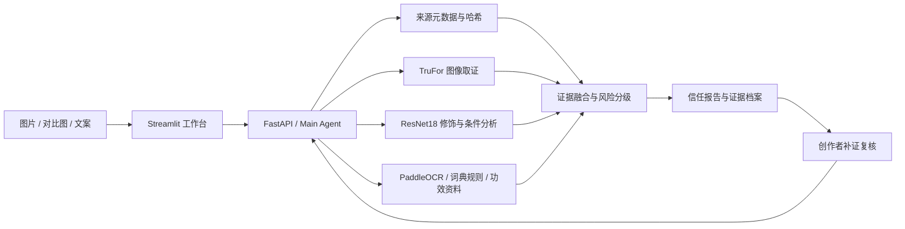

<div align="center">

# TrueGlow 映真

### 让美妆内容的可信度，有据可查。

面向美妆图片与文案的多模态内容核验工作台

**图像取证 · 修饰检测 · 前后对比 · 宣称分析 · 创作者复核**

[快速启动](#快速启动) · [演示流程](#演示流程) · [模型说明](docs/MODEL_USAGE.md)

</div>

## 我们希望解决什么

一张令人心动的美妆对比图，可能同时受到妆容、光照、拍摄条件和后期修饰的影响。“原相机”“零滤镜”“持妆一整天”等宣称，也需要与图片及产品证据一起理解。

TrueGlow 将分散的检测信号整理为可追溯的内容信任报告，帮助消费者理解疑点，也让创作者有机会补充原始材料、申请复核。证据不足时明确表达不确定性，让每一项结论都能找到依据。

## 核心体验

| 工作区 | 可以做什么 |
| --- | --- |
| 内容核验 | 上传图片、填写文案，可补充前图和评论；查看取证信号、修饰分析、条件差异与风险解释 |
| 创作者复核 | 关联已有报告、补充原始材料与拍摄说明，查看复核后的结论 |
| 证据档案 | 查看当前会话报告及证据详情，导出 JSON 核验记录 |
| 文案与功效 | 分析宣称、否定表达及夸张用语，匹配产品资料中的功效证据与局限 |
| 评测工作台 | 查看配对数据、评测结果与模拟样例，支持本地评测及志愿者采集流程 |

## 项目亮点

- **多路证据联合判断**：把来源信息、图像异常、修饰信号、前后条件和文案放在同一条核验链路中。
- **可解释、可追溯**：报告保留工具状态、证据来源、模型信息及局限，并给出建议补充的材料。
- **支持补证复核**：从一次性判断延伸到“核验 → 补证 → 复核”的完整流程。
- **明确处理不确定性**：工具失败或证据缺失时返回部分结果与 Unknown，不用模拟结果替代真实检测。

## 技术架构



前端使用 **Streamlit**，后端使用 **FastAPI / Pydantic**，视觉模型基于 **PyTorch**，文字识别使用 **PaddleOCR**。Main Agent 默认采用确定性规划、融合与模板解释；核心流程不依赖在线大语言模型。

## 快速启动

已验证环境：**Windows + Python 3.12**。在 PowerShell 中执行：

```powershell
git clone https://github.com/chloewen18/TrueGlow_BeautyProof_Agent.git
cd TrueGlow
py -3.12 -m venv .venv
.venv/Scripts/python.exe -m pip install -r requirements-verified-win-py312.txt
powershell -ExecutionPolicy Bypass -File scripts/start_local.ps1
```

启动后访问：

- 工作台：<http://127.0.0.1:8503/>
- API 文档：<http://127.0.0.1:8000/docs>

**真实图像推理需要单独准备模型权重**，安装依赖不会自动下载全部模型。TruFor 权重位于 `data/models/trufor.pth.tar`，修饰与条件模型位于 `data/models/member3/`；详细配置见[本地部署说明](docs/LOCAL_DEPLOYMENT.md)。缺少权重时可使用页面中明确标注的模拟案例了解报告流程，但不能据此获得真实图像核验结果。

## 演示流程

1. 打开「内容核验」，上传美妆图片并输入相关文案；需要比较妆效时补充前图。
2. 运行核验，展示报告中的主要发现、逐工具状态、异常区域和证据局限。
3. 进入「文案与功效」，展示宣称提取及产品证据匹配。
4. 进入「创作者复核」，关联报告并补充原始材料，查看结论变化。
5. 在「证据档案」导出报告，在「评测工作台」说明评测范围。

无模型环境下，可使用明确标注的模拟案例展示交互。模拟案例只说明产品流程，不计入模型效果。

## 评测与适用边界

项目提供真实推理适配器、评测脚本和结果记录。已有配对数据评测尚未排除训练重叠，文案测试集也曾用于规则迭代，因此不将这些结果宣传为独立泛化准确率。评测方法与限制见[数据与评测](docs/DATASET_AND_EVAL.md)。

TrueGlow 是黑客松原型：检测信号不能证明创作者造假意图，前后差异不能证明产品因果功效；当前未实现 C2PA 验证。系统以本机运行与演示为目标，尚未完成面向公网的认证及数据隔离。

## 项目导航

| 路径 | 内容 |
| --- | --- |
| `app.py`、`api/` | 工作台页面与接口客户端 |
| `backend/app/` | Agent、工具适配、报告、API 与证据存储 |
| `assets/`、`styles/` | 视觉资源与主题样式 |
| `member2_forensics/`、`member3_dataset/`、`member4_text/` | 模型说明、词典、证据库及评测资源 |
| `data/`、`schemas/`、`examples/` | 数据、共享结构与演示响应 |
| `scripts/`、`tests/` | 启动、评测与自动化验证 |
| `vendor/trufor/` | 第三方模型源码及原始许可证 |

[部署指南](docs/LOCAL_DEPLOYMENT.md) · [目录说明](docs/PROJECT_STRUCTURE.md) · [API 说明](docs/API_SPEC.md) · [模型使用声明](docs/MODEL_USAGE.md)

## 验证

```powershell
.venv/Scripts/python.exe -m unittest discover -s tests -p 'test_*.py'
# 以下命令需要已启动后端并配置模型及 OCR
.venv/Scripts/python.exe scripts/check_end_to_end.py
```

## 致谢与许可

感谢 TruFor、PyTorch、PaddleOCR、Streamlit、FastAPI 等开源项目。第三方代码与数据遵循各自许可证；TruFor 的许可包含非营利用途限制，详见 [LICENSE](vendor/trufor/LICENSE.txt) 与 [CMX LICENSE](vendor/trufor/LICENSE_CMX.txt)。数据集说明见 [Dataset Card](data/datasets/FFHQ_FFHQR_100_pairs_v1/DATASET_CARD.md)。模型与数据的使用范围详见[模型使用声明](docs/MODEL_USAGE.md)。
